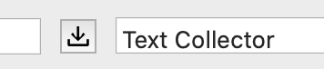

# Text Collector
A RoboFont start-up script that places a button to the left of the main input text dialog in your Space Center. This button, when pressed, saves the current string to the Input Text tab in your RoboFont preferences.




### To Do:
* Clean it up.
* Take feedback.
* Make into a RoboFont extension.


### Versions:

```
1.0.0 2020-01-28
```